# Administration des Bases de données avec Oracle 

Ce quide a pour objectif de vous illustrer les étapes à suivre 
pour bien installer Oracle 11g.

Vous trouverez dans ce [lien](https://drive.google.com/file/d/11LkeSwxDTBx0Dhn9nQreCL-WC5d36yHR/view) le fichier à télécharger.

## Installation d'Oracle

Une fois le fichier téléchargé, décompressez le et double cliquez sur "setup" : 

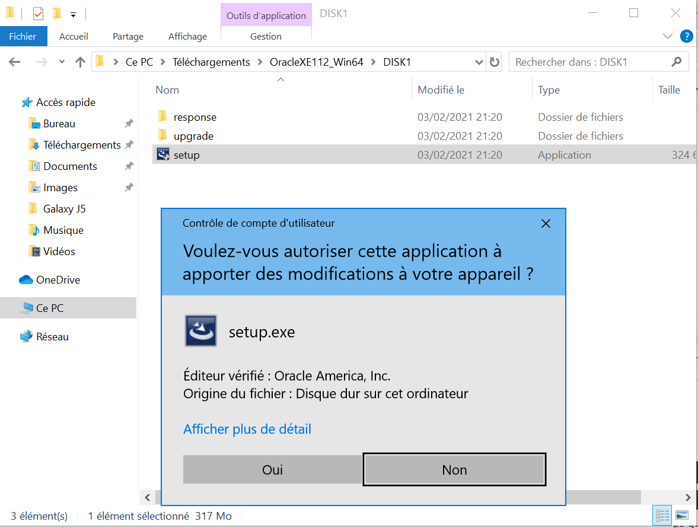

Ensuite, cliquez sur "Next" :

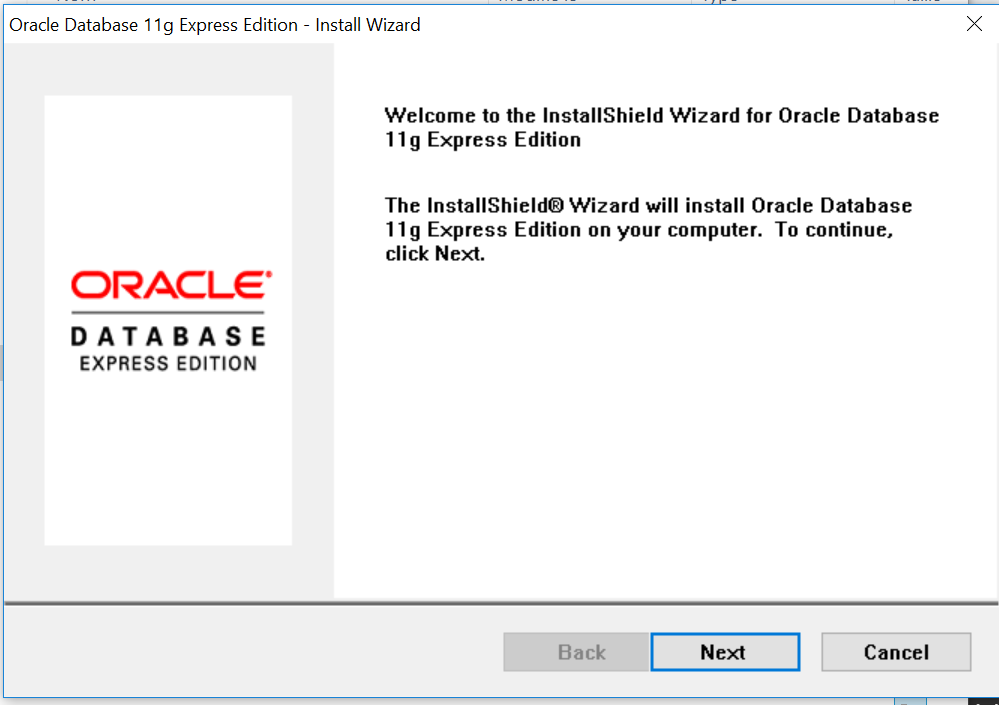

Puis, acceptez le contrat de licence :

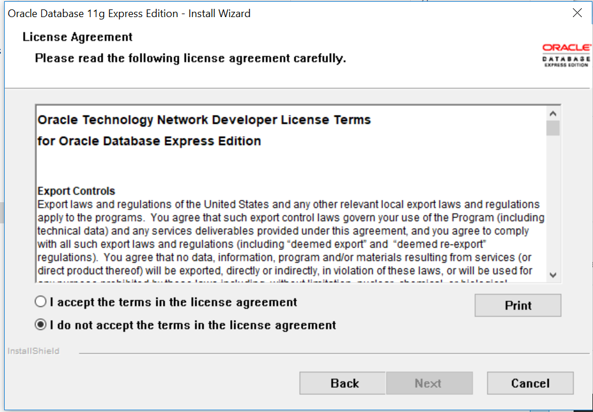

Par la suite, saisissez le mot de passe de la base de données **(essayez de vous en souvenir !! )** :

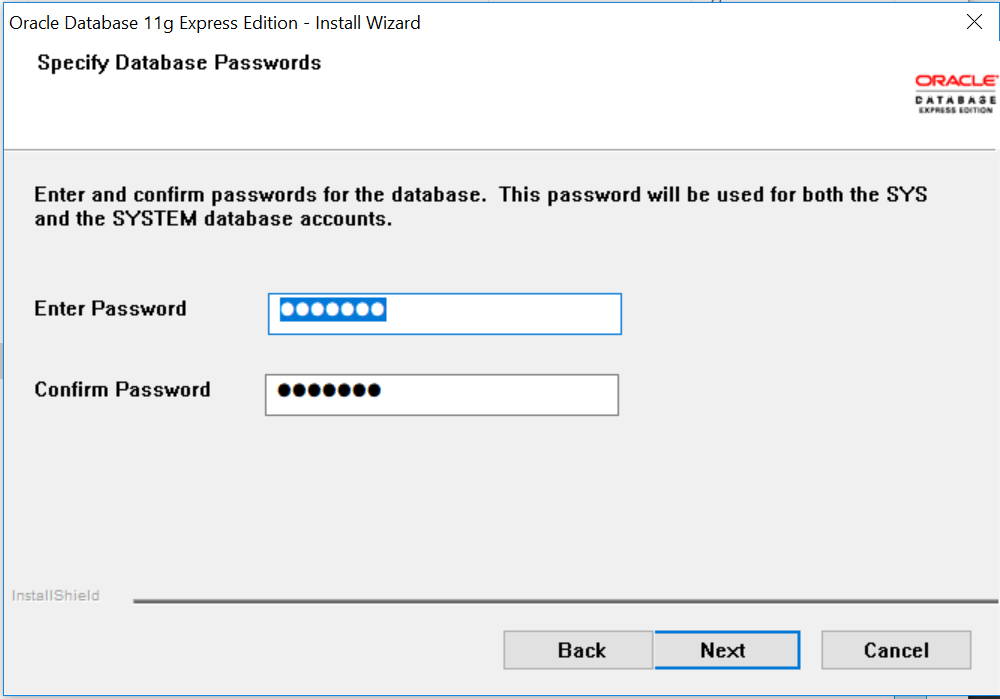

Et enfin, cliquez sur "installer" pour démarrer l'installation :

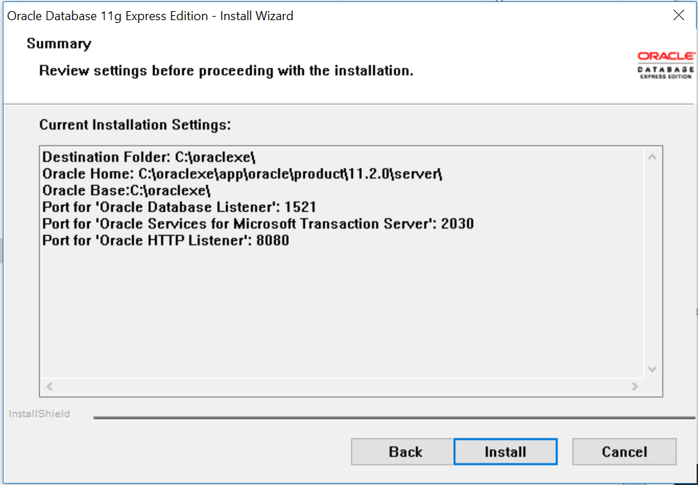

Une fois l'installation terminée, vous trouverez le raccourci sur votre bureau : 

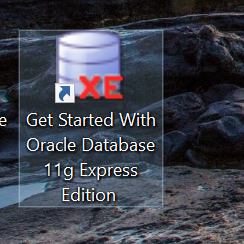

## Exécution d'Oracle

Lorsque vous double cliquez sur l'icône d'Oracle, vous serez redirigé vers une page web :

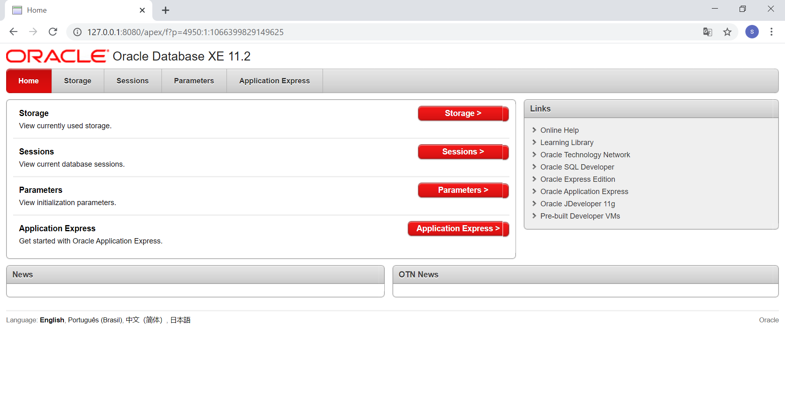

Par la suite, cliquez sur **"Application Express"**, vous serez amené à vous authentifier.
Saisissez le login **"system"** et le mot de passe celui que vous avez saisi auparavant : 

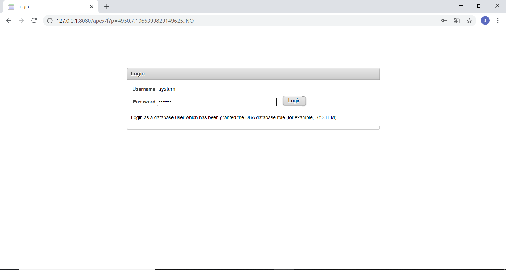

Puis, vous pouvez créer votre base de données comme illustré sur l'image qui suit :

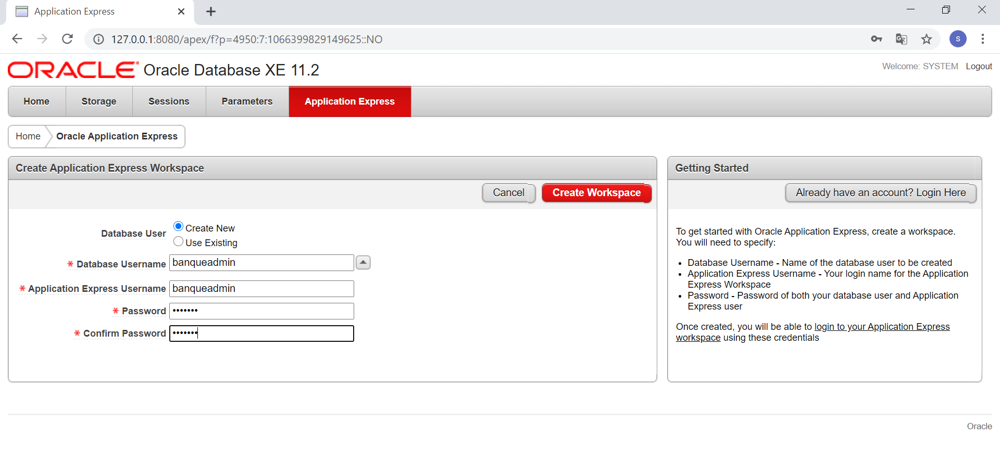

Une fois terminée, cliquez sur "create workspace" vous serez redirigé à la page principale 
et cliquez sur le lien présent dans la notification :

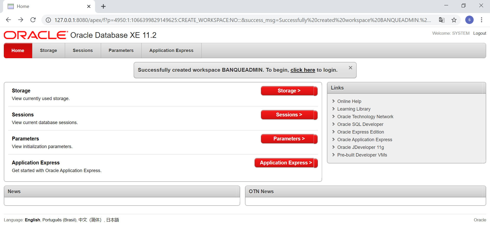

Vous serez amené à saisir les coordonnées saisies auparavant : 

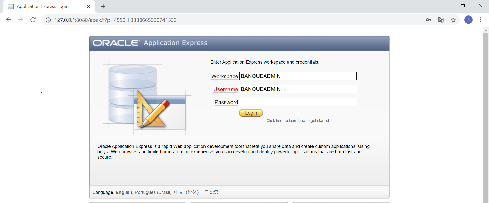

Une fois authentifié, vous serez redirigé vers la page principale de votre workspace : 

Puis cliquez sur **"SQL workshop"**, pour passer vers l'invite de commande d'Oracle : 

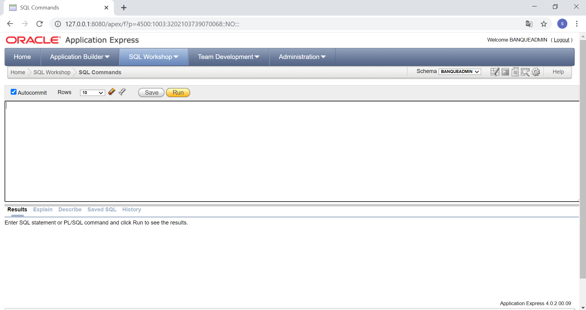

Bravo !!

Maintenant, Vous pouvez saisir vos propres scripts SQL pour interagir avec votre base de données.

