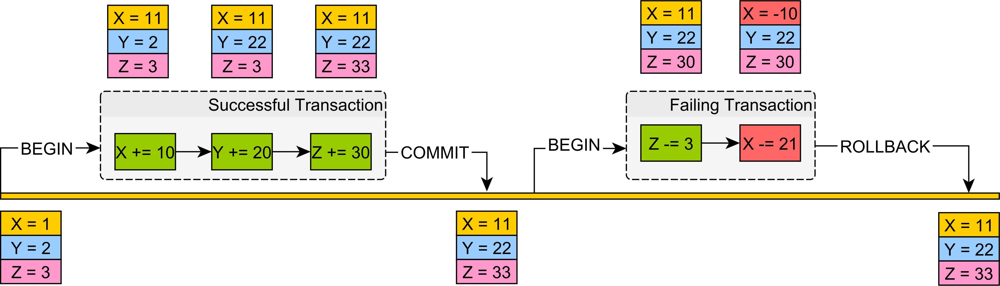

# TP1

Vous trouverez dans ce [lien]() la présentation utilisée dans ce TP.

## SGBD ?

Un système de gestion de base de données est un logiciel qui permet de 
stocker des informations dans une base de données ainsi, il nous permet de
**Lire / Écrire / Modifier / Trier / Transformer / Afficher
les données**

## Rappel

Les commandes SQL sont divisées en quatre sous-groupes, DDL, DML, DCL et TCL :

- **Data Definition Language** : DDL qui traite des schémas et des descriptions des bases de données, de la manière 
dont les données doivent résider dans la base (Create / Alter / Drop / Truncate / ..).
- **Data Manipulation Language** : DML qui manipule des données et comprend les instructions SQL les plus courantes 
telles que SELECT, INSERT, UPDATE, DELETE, etc. et qui est utilisé pour stocker, modifier, récupérer, supprimer et mettre à jour des données dans une base de données.
- **Data Control Language** : DCL qui comprend des commandes telles que GRANT 
et qui concerne principalement les droits, les autorisations et autres contrôles du système de base de données.
- **Transaction Control Language** : TCL qui traite d'une transaction au sein d'une base de données.


### Excercice 1:

- **Supprimer le départemet numéro 20 :**  

```sh
DELETE FROM DEPT WHERE DEPTNO = 20 ;
```
- **Supprimer tous les employées du département numéro 20 qui n'ont pas encore une COMM :**  

```sh
DELETE FROM EMP WHERE DEPTNO = 20 and COMM IS NULL; ;
```

- **Supprimer tous les départements réstants :**  

```sh
DELETE FROM DEPT ;
```

- **Supprimer tous les employées réstants :**  

```sh
DELETE FROM EMP  ;
```

- **Supprimer la TABLE des départements :**  

```sh
DROP TABLE  DEPT CASCADE CONSTRAINTS;
```

- **Supprimer la TABLE des employées :**  
```sh
DROP TABLE  EMP CASCADE CONSTRAINTS;
```

- **Créer la TABLE des départements avec :**  

  _ DEPTNO numéro (deux chiffres) clé primaire

  _ DNAME chaine de charactères avec longeur max = 14

  _ LOC chaine de charactères avec longeur max = 13


```sh
CREATE TABLE  "DEPT" 
   (
    "DEPTNO" NUMBER(2,0), 
	"DNAME" VARCHAR2(14), 
	"LOC" VARCHAR2(13), 
	 PRIMARY KEY ("DEPTNO") ENABLE
   ) ;
```

- **Créer la TABLE des employées avec :**  

  _ EMPNO numéro (4 chiffres) clé primaire

  _ ENAME chaine de charactères avec longeur max = 10

  _ MGR numéro (4 chiffres) qui est aussi un employé

  _ HIREDATE Date

  _ SAL décimal (7 chiffres , deux après la vir ) 

  _ COMM décimal (7 chiffres , deux après la vir ) 

  _ DEPTNO numéro (deux chiffres) clé étrangère 


```sh

CREATE TABLE  "EMP" 
   (	
    "EMPNO" NUMBER(4,0) NOT NULL ENABLE, 
	"ENAME" VARCHAR2(10), 
	"JOB" VARCHAR2(9), 
	"MGR" NUMBER(4,0), 
	"HIREDATE" DATE, 
	"SAL" NUMBER(7,2), 
	"COMM" NUMBER(7,2), 
	"DEPTNO" NUMBER(2,0), 
	 PRIMARY KEY ("EMPNO") ENABLE
   ) ;

ALTER TABLE  "EMP" ADD FOREIGN KEY ("DEPTNO")
	  REFERENCES  "DEPT" ("DEPTNO") ENABLE;

ALTER TABLE  "EMP" ADD FOREIGN KEY ("MGR")
	  REFERENCES  "EMP" ("EMPNO") ENABLE;

```


- **Populer la TABLE des employées avec des lignes de données:**  

```sh
Insert into DEPT (DEPTNO,DNAME,LOC) values ('10','ACCOUNTING','NEW YORK');
Insert into DEPT (DEPTNO,DNAME,LOC) values ('20','TEST','DALLAS');
Insert into DEPT (DEPTNO,DNAME,LOC) values ('30','SALES','CHICAGO');
Insert into DEPT (DEPTNO,DNAME,LOC) values ('40','OPERATIONS','BOSTON');
```


- **Affichez seulement le nom du du département numéro 20 :**  

```sh
SELECT DNAME from DEPT WHERE DEPTNO = 20; 
```


- **Changez le nom du département numéro 20 en "RESEARCH" au lieu de "TEST" :**  

```sh
Update DEPT SET DNAME = 'RESEARCH' WHERE DEPTNO = 20 ;
```


- **Populer la TABLE des employées avec des lignes de données:**  

```sh
Insert into EMP (EMPNO,ENAME,JOB,MGR,HIREDATE,SAL,COMM,DEPTNO) values ('7839','KING','PRESIDENT',null,to_date('17/11/81','DD/MM/RR'),'5000',null,'10');
Insert into EMP (EMPNO,ENAME,JOB,MGR,HIREDATE,SAL,COMM,DEPTNO) values ('7698','BLAKE','MANAGER','7839',to_date('01/05/81','DD/MM/RR'),'2850',null,'30');
Insert into EMP (EMPNO,ENAME,JOB,MGR,HIREDATE,SAL,COMM,DEPTNO) values ('7782','CLARK','MANAGER','7839',to_date('09/06/81','DD/MM/RR'),'2450',null,'10');
Insert into EMP (EMPNO,ENAME,JOB,MGR,HIREDATE,SAL,COMM,DEPTNO) values ('7566','JONES','MANAGER','7839',to_date('02/04/81','DD/MM/RR'),'2975',null,'20');
Insert into EMP (EMPNO,ENAME,JOB,MGR,HIREDATE,SAL,COMM,DEPTNO) values ('7788','SCOTT','ANALYST','7566',to_date('09/12/82','DD/MM/RR'),'3000',null,'20');
Insert into EMP (EMPNO,ENAME,JOB,MGR,HIREDATE,SAL,COMM,DEPTNO) values ('7902','FORD','ANALYST','7566',to_date('03/12/81','DD/MM/RR'),'3000',null,'20');
Insert into EMP (EMPNO,ENAME,JOB,MGR,HIREDATE,SAL,COMM,DEPTNO) values ('7369','SMITH','CLERK','7902',to_date('17/12/80','DD/MM/RR'),'800',null,'20');
Insert into EMP (EMPNO,ENAME,JOB,MGR,HIREDATE,SAL,COMM,DEPTNO) values ('7499','ALLEN','SALESMAN','7698',to_date('20/02/81','DD/MM/RR'),'1600','300','30');
Insert into EMP (EMPNO,ENAME,JOB,MGR,HIREDATE,SAL,COMM,DEPTNO) values ('7521','WARD','SALESMAN','7698',to_date('22/02/81','DD/MM/RR'),'1250','500','30');
Insert into EMP (EMPNO,ENAME,JOB,MGR,HIREDATE,SAL,COMM,DEPTNO) values ('7654','MARTIN','SALESMAN','7698',to_date('28/09/81','DD/MM/RR'),'1250','1400','30');
Insert into EMP (EMPNO,ENAME,JOB,MGR,HIREDATE,SAL,COMM,DEPTNO) values ('7844','TURNER','SALESMAN','7698',to_date('08/09/81','DD/MM/RR'),'1500','0','30');
Insert into EMP (EMPNO,ENAME,JOB,MGR,HIREDATE,SAL,COMM,DEPTNO) values ('7876','ADAMS','CLERK','7788',to_date('12/01/83','DD/MM/RR'),'1100',null,'20');
Insert into EMP (EMPNO,ENAME,JOB,MGR,HIREDATE,SAL,COMM,DEPTNO) values ('7900','JAMES','CLERK','7698',to_date('03/12/81','DD/MM/RR'),'950',null,'30');
Insert into EMP (EMPNO,ENAME,JOB,MGR,HIREDATE,SAL,COMM,DEPTNO) values ('7934','MILLER','CLERK','7782',to_date('23/01/82','DD/MM/RR'),'1300',null,'10');


```


## Transaction ?

C'est une séquence d’opérations de lecture ou de mise à jour sur une base de données, 
se terminant par l’une des deux instructions suivantes : **Commit / Rollback**.



## Propriétés des transactions


- **Atomicité** : soit tous les éléments sont validés, soit aucun ne l'est. La transaction se fait donc entièrement ou pas du tout.
- **Cohérence** : une transaction crée un état des données nouveau et valide, soit, en cas de panne, elle rétablit toutes les données dans l'état qui était le leur avant le début de la transaction.
- **Isolation** : une transaction en cours, doit rester isolée de toutes les autres.
- **Durabilité** : les données validées sont enregistrées par le système de sorte que, même en cas de panne et de redémarrage du système, ces données restent disponibles dans leur état correct. 


