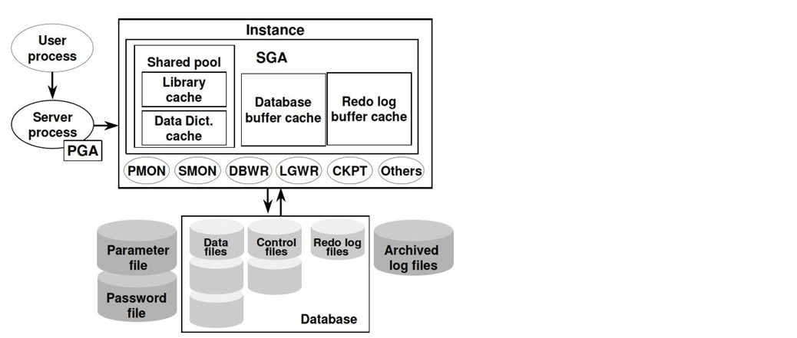
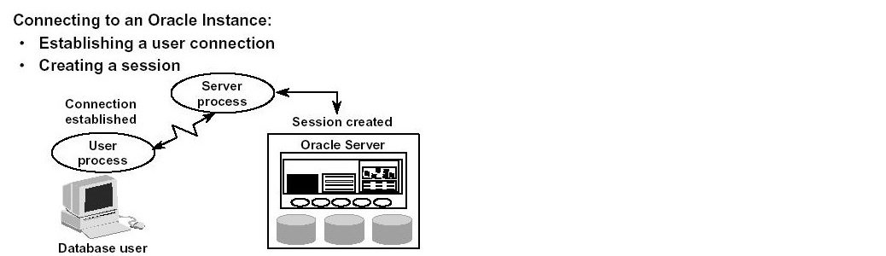

# TP3

Vous trouverez dans ce [lien](https://docs.google.com/presentation/d/1WO4ZPoTGBLJoM6L_9MnQtKQD4ziRDP0reLbJGzPV6aQ/edit?usp=sharing) la présentation utilisée dans ce TP.

## Introduction

Dans cette partie, nous allons détailler l'architecture de la base de données Oracle 11g.

## Architecture BD Oracle 11g

<p align="center">
  
</p>


### 1/ Instance Oracle

- Il s'agit d'accéder à une base de données Oracle
- Il démarre toujours une et une seule **instance** de la base de données

#### - Demo:
- **Se connecter en tant que Administrateur DB**  

``` sh
connect sys/sys_password as sysdba 
```


- **Arrêter l'instance oracle d'une façon normale:**  

```sh
shutdown normal 
```

- **Démarrer l'instance Oracle sans monter la base**  

```sh
startup nomount; 
```

- **Monter la base de données sans l'ouvrir:**  

```sh
alter database mount;
```

- **Ouvrir la base de données:**  

```sh
alter database open;
```

- **Fermer la base et la réouvrir en mode lecture seule:**  

```sh
alter database close;
alter database open read only;
```

- **Démonter la base**  

```sh
alter database dismount;
```
 
- **Arrêter l'instance oracle en abondonnant les transactions en cours, et par la suite démarrer la base en réinitialisant les fichiers journaux:**  

```sh
shutdown abandon;
startup open resetlogs;
```

- **Arréter l'instance oracle sans invalider les transactions en cours et en bloquant les nouvelles transaction , et par la suite forcer le démarrage de la base de données :**  

```sh
shutdown transactional;
startup force;
```
- **Démarrer la base de données en mode "Maintenance"  :** 

 ```sh
startup restrict;
```

- **Afficher les colonnes de la vue de données de l'instance Oracle:**  

```sh
DESC v$INSTANCE;
```
- **Afficher les colonnes de la vue de données de la base de données:**  

```sh
DESC v$DATABASE;
```
### 2/ Architecture Processus

Un processus est un mécanisme dans un système d'exploitation qui peut exécuter une série d'instructions. Certains systèmes d'exploitation utilisent les termes job ou tâche. Un processus possède généralement sa propre zone de mémoire privée dans laquelle il s'exécute.

Un serveur de base de données Oracle possède deux types généraux de processus : les processus utilisateur et les processus serveur que nous détaillerons dans les sections suivantes.

<p align="center">
  
</p>

### 3/ Structure Mémoire

La structure mémoire représente une version "vivante" d'Oracle qui n'est disponible que lorsque l'instance est en cours d'exécution. Il existe deux structures de mémoire de base sur l'instance Oracle. La première et la plus importante est appelée **System Global Area**, communément appelée **SGA**. L'autre structure de mémoire de l'instance Oracle s'appelle le **Program Global Area**, ou **PGA**. 

#### A/ System Global Area

La SGA d'Oracle est la structure de mémoire la plus importante d'Oracle.
Elle permet de stocker plusieurs composants différents de la mémoire qui sont conçus pour exécuter des processus afin d'obtenir des données pour les requêtes des utilisateurs aussi rapidement que possible tout en maximisant le nombre d'utilisateurs simultanés qui peuvent accéder à l'instance Oracle.
- **Afficher les colonnes de la vue de données de la SGA:**  

```sh
DESC v$SGA;
DESC V$SGAINFO;
```

Elle est essentiellement composée de : 

#### - Shared Pool :

Commande : ``` show parameter shared_pool_size ```

- **Library Cache** :
	-  Il stocke des informations sur les déclarations sql et Pl-sql récemment utilisées.
	- Contrôle sémantique - il vérifie le privilège des commandes émises par l'utilisateur.
	- Contrôle syntaxique - il vérifie la syntaxe des commandes émises par l'utilisateur.
- **Data Dictionary Cache**:
	- Il stocke la collection des définitions les plus récemment utilisées dans les bases de données, y compris les fichiers de base de données, les tables, les index, les colonnes, etc.
	- Il contient les informations sur la base de données et est en lecture seule.
		
	Commande : ``` show parameter db_block_size =8kb is default size,
   show parameter db_cache_size```
#### - Database Buffer Cache : 	
Il stocke les copies des blocs de données qui ont été récupérés dans les fichiers de données de la base.

Commande : ``` show parameter log_file ```

#### - Redo log Buffer Cache :
Il conserve les enregistrements des blocs de base de données modifiés et son objectif principal est la récupération.
Commande : ```	SHOW PARAMETER LOG_BUFFER ;```
#### B/ Program Global Area

- Réserver de la mémoire pour chaque processus utilisateur souhaitant se connecter à la BD Oracle
- Allouer de la mémoire lorsqu'un processus est créé
- Désallouer la mémoire lorsqu'un processus est terminé.


	#### 1 / Processus Utilisateur

	- Un programme qui demande une interaction avec le serveur oracle
	- Il doit d'abord établir une connexion
	- Il n'interagit pas directement avec l'instance Oracle 


	#### 2/ Processus Serveur

	- Il interagit directement avec l'instance Oracle
	- Il peut s'agir d'un serveur dédié ou partagé
	- Il répond toujours aux demandes des utilisateurs
	
	#### 3/ Processus en arrière plan

	- Il renforce la relation entre la structure de la mémoire et la base de données.
	
		-  **PMON** :
		
			- Prise en charge de tous les processus d'arrière-plan

			- Nettoyage après l'échec d'un processus

			- Retour en arrière (Rolling Back)

		-  **SMON** :
		
			- Surveillance du système
			- Récupération d'instance
			- Transférer les changements dans les redologs
			- Ouverture de la base de données pour l'accès des utilisateurs

		-  **DBWR** :
			
			- Erreur de temps mort

			- Tablespace hors ligne

			- Tablespace en lecture seule
			
		-  **LGWR** :

			- Au moment du commit

			- Toutes les 3 secondes

			- Intervient au moment ou Redolog Buffer a atteint un tiers de sa capacité
			
		- **CHKPT** :
		
			- Mise à jour du Control file avec les informations du point de contrôle.
- **Afficher les noms des processus arrière plan de l'instance BD:**  

```sh
select pname from v$process
```
			
## 4/ BD Physique
La base de données est une collection de données qui contient des **Data files**, des **Control files** et des **Redolog files**.

### A/ Data files 

- Il s'agit d'une partie d'une base de données oracle, qui stocke les données, notamment les données utilisateur et les données d'annulation.

- Son extension est ".dbf".

- L'emplacement par défaut est " $ORACLE_BASE/oradata".

- Pour voir l'emplacement dans la base de données, utilisez cette commande : ```Select name from V$datafile; ```

### B/ Control files 

 - C'est le cœur de la base de données

- Il contient les informations sur les Data files, les emplacements des fichiers redo log et les informations de sauvegarde (heure de début et heure de fin).

- Son extension est ".ctl".

- Commande : ```Show parameter control_files ```

### C/ Redo Log files 

- C'est une partie d'une base de données oracle

- Son but principal est de récupérer la base de données.

- Son extension est ".log".

- Lorsque la transaction est validée, les détails du tampon de redo log sont écrits dans un fichier redo log.

- Commande : ``` select * from V$log; or Select * from V$logfile ; ```

## 4/ Les espaces de tables et les schémas:

- **Créer un espace de tables permanent avec ayant le nom 'tbs_perm_001' avec un fichier de données nommé tbs_perm_001.dat, dont la taille est de '20 MB' et metter le en ligne :**  

```sql
CREATE TABLESPACE tbs_perm_01
  DATAFILE 'tbs_perm_01.dat' 
    SIZE 20M
  ONLINE;
```

- **Créer un espace de tables permanent avec ayant le nom 'tbs_perm_02' avec un fichier de données nommé tbs_perm_02.dat, dont la taille initiale est de '10 MB' extensible automatiquement chaque augmentation de 10MB avec une limite de 200MB**  

```sql
CREATE TABLESPACE tbs_perm_02
  DATAFILE 'tbs_perm_02.dat' 
    SIZE 10M
    REUSE
    AUTOEXTEND ON NEXT 10M MAXSIZE 200M;
```

- **Créer un espace de tables de type "BIGFILE TABLESPACE" permanent avec ayant le nom 'tbs_perm_01' avec un fichier de données nommé tbs_perm_01.dat, dont la taille initiale est de '10 MB' extensible automatiquement et illimitée, et metter le en ligne :**  

```sql
CREATE BIGFILE TABLESPACE tbs_perm_01
  DATAFILE 'tbs_perm_01.dat'
    SIZE 10M
    AUTOEXTEND ON;
```

- **Créer un espace de tables temporaire avec ayant le nom 'tbs_tmp_01' avec un fichier de données temporaire nommé tbs_tmp_01.dbf, dont la taille initiale est de '5 MB' extensible automatiquement :**  

```sql
CREATE TEMPORARY TABLESPACE tbs_tmp_01
  TEMPFILE 'tbs_tmp_01.dbf'
    SIZE 5M
    AUTOEXTEND ON;
```

- **Afficher les noms des espaces de tables de la base de données :**  

```sql
SELECT TABLESPACE_NAME
FROM DBA_TABLESPACES ;
```
- **Créér un nouveau utilisateur nommé "tsuser1" ayant un mot de passe "tsuser1" dont l'espace de tables par défaut est "tbs_perm_01" et l'espace de table temporaire est "tbs_tmp_01" avec un quota mémoire de 50M max sur l'espace de tables permanent "tbs_perm_01" :**  

```sql
CREATE USER tsuser1
  IDENTIFIED BY tsuser1
  DEFAULT TABLESPACE tbs_perm_01
  TEMPORARY TABLESPACE tbs_tmp_01
  QUOTA 50M on tbs_perm_01;
```
- **Accorder au user "tsuser1" tous les privilèges avec le role Admin :**  

```sql
GRANT ALL PRIVILEGES TO tsuser1 with admin option ;
flush privileges;
```
- **Ouvrir une session oracle avec l'utilisateur "tsuser1":**  

```sql
connect tsuser1/tsuser1 
```
- **Afficher le schéma courrant de la session, changer le schéma de la session vers le schéma par défaut du user "tsuser1" :**  

```sql
select sys_context( 'userenv', 'current_schema' ) from dual;
Alter session set current_schema=tsuser1;
```
- **Vérifier que le schéma  courrant de la session est bien le schéma par défaut du user "tsuser1, créer par la suite une nouvelle table avec une seule colonne number en tant que clè primaire":**  

```sql
select sys_context( 'userenv', 'current_schema' ) from dual;
create table test1( pkey number primary key enable )
```
- **Afficher toutes les lignes de la table créée et insérer par la suite une nouvelle ligne dans cette table:**  

```sql
select * from test1 ;
insert into test1 values (1) ;
```
- **Supprimer l'espace de tables permanent ayant le nom 'tbs_perm_01' avec ses données :**  

```sql
DROP TABLESPACE tbs_perm_01 INCLUDING CONTENTS ;
```

- **Supprimer l'espace de tables temporaire ayant le nom 'tbs_tmp_01' avec ses données :**  

```sql
DROP TABLESPACE tbs_tmp_01 INCLUDING CONTENTS ;
```
