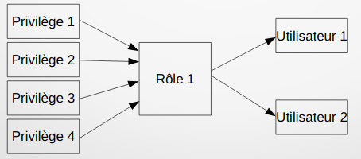

# TP4

Vous trouverez dans ce [lien](https://docs.google.com/presentation/d/1tonsLynHdpmkTqB0wCP2WNfBjltlScxK00hekP2wruo/edit?usp=sharing) la présentation utilisée dans ce TP.

## Introduction

Dans cette partie, nous allons détailler le langage de contrôle des données.

## Gestion des privilèges

Un privilège donne le droit d'exécuter certaines commandes SQL ou le droit d'accéder à certaines ressources.

Oracle possède deux types de privilèges :
- les privilèges systèmes
- les privilèges objets.

Un privilège peut être affecté (retiré) à:
- un Utilisateur,
- un Rôle
- tous les utilisateurs (PUBLIC).

Les privilèges donnent le droit de réaliser des opérations systèmes.

Ces privilèges sont classés par catégories d'objets.

Exemple de privilèges systèmes de la catégorie TABLE:
- CREATE TABLE 
- CREATE ANY TABLE
- ALTER ANY TABLE 
- BACKUP ANY TABLE
- DROP ANY TABLE 
- SELECT ANY TABLE
- INSERT ANY TABLE 
- UPDATE ANY TABLE
- DELETE ANY TABLE 
- ...

Affectation d'un privilège : 
```GRANT { system_priv | role } TO { user | role | PUBLIC }```

Révocation d’un privilège :
```REVOKE { <system_priv> | <rôle> } FROM { <utilisateur> | <rôle> | PUBLIC }```

## Gestion des rôles

Un rôle est un concept Oracle qui permet de regrouper plusieurs privilèges et /ou rôles afin de les affecter ou retirer en bloc à un utilisateur et /ou un rôle.

Un rôle facilite la gestion des privilèges.

Pour créer un rôle, il faut avoir le privilège ```CREATE ROLE```

<p align="center">
  
</p>

<p align="center">
  
</p>

Pour créer un rôle : ```CREATE ROLE rôle [ { NOT IDENTIFIED | IDENTIFIED { BY password | EXTERNALLY | GLOBALLY | USING package} ]```
avec : 
- NOT IDENTIFIED : permet de créer un rôle sans mot de passe
- EXTERNALLY : mot de passe est contrôlé au niveau de l'OS
- GLOBALLY : Rôle autorisé au niveau de l’annuaire
- USING package : rôle applicatif.

Pour supprimer un rôle : ```DROP ROLE role```

## Gestion des profils

Un profile est un concept Oracle qui permet à l'administrateur d'une base de contrôler la consommation des ressources systèmes et des mots de passes.

Pour créer un profil : ``` CREATE PROFILE profile LIMIT[ SESSIONS_PER_USER { integer | UNLIMITED | DEFAULT} ][ CPU_PER_SESSION { integer | UNLIMITED | DEFAULT } ][ CPU_PER_CALL { integer | UNLIMITED | DEFAULT } ][ CONNECT_TIME { integer | UNLIMITED | DEFAULT } ][ IDLE_TIME { integer | UNLIMITED | DEFAULT } ][LOGICAL_READS_PER_SESSION {integer | UNLIMITED|DEFAULT}][LOGICAL_READS_PER_CALL {integer | UNLIMITED|DEFAULT}][ COMPOSITE_LIMIT { integer | UNLIMITED | DEFAULT } ][PRIVATE_SGA {integer [K | M] | UNLIMITED | DEFAULT}]```
avec : 
- Session_per_user : Nombre maximum de sessions par utilisateur
- Logical_read_per_session : Nbre de blocs de données à lire pour une session
- cpu_per_session : temps CPU max par session en % de sécondes
- cpu_per_call : temps CPU pour un appel (en cas de parse, execute ou fetch) en % de secondes
- connect_time : temps écoulé maximum (en minutes)
- idle_time : temps maximum d'inactivité.
- private_sga : taille privée de la SGA allouée à un utilisateur
- unlimited : limite de la ressource illimitée
- default : prend la limite par défaut de la ressource.

## Gestion des utilisateurs
Lors de la création d'un utilisateur, il est possible de lui affecter : un mot de passe, un tablespace par défaut, un tablespace temporaire, un profile (explicite ou implicite), des quotas sur les tablespaces.

```CREATE USER user IDENTIFIED { BY password | EXTERNALLY| GLOBALLY AS‘nom_externe’ } [ DEFAULT TABLESPACE tablespace ] [ TEMPORARY TABLESPACEtablespace ] [ QU0TA { integer [ K | M ] | UNLIMITED } ON tablespace ] ...[ PROFILE profile ] [PASSWORD EXPIRE] [ACCOUNT {LOCK | UNLOCK}]```
avec : 
- Externally : utilisateur authentifié par l'OS
- globally as : accès autorisé par l’annuaire LDAP

Lors de la modification d'un utilisateur, il est possible de lui affecter : un mot de passe, un tablespace par défaut, un tablespace temporaire, un profile (explicite ou implicite), des quotas sur les tablespaces et un rôle par défaut (parmi les rôles attribués par la commande grant).

 Exemples : 
 ```ALTER USER etu1_21 IDENTIFIED BY md2000p DEFAULT TABLESPACE usersQUOTA UNLIMITED ON users QUOTA 1M ON system;```
``` ALTER USER etu1_21 DEFAULT ROLE role_etu1;```

 La suppression d'un utilisateur entraîne la suppression des objets de son schéma (tables, vues, séquences, synonymes, indexes ... ) . Le privilège drop user est requis.
 
 ```DROP USER ETU1_33;``` -> suppression d'un utilisateur lié à un schéma vide
 
 ```DROP USER ETU1_33 CASCADE; ```
 
 - CASCADE : supprime  les objets du schéma de l'utilisateur et les contraintes d'intégrité de référence (et vide la corbeille).
 Rq : les rôles créés par l'utilisateur ne sont pas supprimés.
 
**La portée des privilèges :** 

``` _________________________________________________
Object privilege | Table   | View    | Sequence  |
-------------------------------------------------
ALTER            |   Yup   |   Nope  |  Yup      |
-------------------------------------------------
DELETE           |   Yup   |   Yup   |  Nope     |
-------------------------------------------------
INDEX            |   Yup   |   Nope  |  Nope     |
-------------------------------------------------
INSERT           |   Yup   |   Yup   |  Nope     |
-------------------------------------------------
SELECT           |   Yup   |   Yup   |  Yup      |
-------------------------------------------------
UPDATE           |   Yup   |   Yup   |  Nope     |
_________________________________________________
```


**Pour confirmer/lister les privilèges attribuées sur chaque Type d'Objet par rôle :**
```
__________________________________________________________________________________________________________________________
Vue de privs dans le dictionnaire de données Oracle |     Usage/Displayed Data
---------------------------------------------------------------------------------------------------------------------------
SELECT * From ROLE_SYS_PRIVS  ;                     | -->  System privileges granted to roles                              |
---------------------------------------------------------------------------------------------------------------------------
SELECT * From ROLE_TAB_PRIVS  ;                     | -->  Table privileges granted to roles                               |
---------------------------------------------------------------------------------------------------------------------------
SELECT * From USER_ROLE_PRIVS ;                     | -->  Roles accessible by the user	                                   |
---------------------------------------------------------------------------------------------------------------------------
SELECT * From USER_SYS_PRIVS  ;                     | -->  System privileges granted to the user                           |
---------------------------------------------------------------------------------------------------------------------------
SELECT * From USER_TAB_PRIVS_MADE ;                 | -->  Object privileges granted on the user’s objects                 |
---------------------------------------------------------------------------------------------------------------------------
SELECT * From USER_TAB_PRIVS_RECD ;                 | -->  Object privileges granted to the user    	                   |
---------------------------------------------------------------------------------------------------------------------------
SELECT * From USER_COL_PRIVS_MADE ;                 | -->  Object privileges granted on the columns of the user’s objects  |
---------------------------------------------------------------------------------------------------------------------------
SELECT * From USER_COL_PRIVS_RECD ;                 | -->  Object privileges granted to the user on specific columns       |
___________________________________________________________________________________________________________________________

```

 
 ## DEMO 

 - **Créer les nouveaux utilisateurs comme suit:**  
      A) Equipe Dev :

      * [ username: dev1, password: dev1 ]
      * [ username: dev2, password: dev2 ]
      
      B) Equipe Test :

      * [ username: tester1, password: tester1 ]
      * [ username: tester2, password: tester2 ]
     
     
     C) Equipe DevSecOps :      
      * [ username: devsecops1, password: devsecops1 ]
      * [ username: devsecops2, password: devsecops2 ]


```sql
---
```
  --->  **Une fois qu'un utilisateur est créé, le DBA peut octroyer des privilèges de système spécifiques à cet utilisateur.**
 

  - **Attribuer les privilèges ci-dessous à l'utilisateur dev1 :** 
 
     * Création de procédures stockées.
     * Création de vue.
     * Création de séquence.
     * Création de session.
     * Création,lecture, modification de structure et suppression de tables.

```sql
---
```

¤   **Une fois qu'un utilisateur est créé, le DBA peut octroyer des privilèges de système spécifiques à cet utilisateur.**
 
 
   - **Révoquer tous les privilèges associès à l'utilisateur dev1 :** 

```sql
---
```

 
  - **Créer des rôles dédiés pour chaque Equipe d'utilisateurs en réspectant les critères suivants** 

      A) Le rôle de l'équipe Dev permet de:

      * Création de procédures stockées.
      * Création de vue.
      * Création de séquence.
      * Création de session.
      * Création,lecture, modification de structure et suppression de tables.
      
      B) Le rôle de l'équipe Test permet de:

      * Se connecter à la base de données.
      * Création de session.
      * Lecture données de toutes les tables.
     
     C) Le rôle de l'équipe DevSecOps permet d'avoir tous les privilèges avec mode administrateur de la base:  

```sql
---
```
```sql
---
```
```sql
---
```
```sql
---
```


 
   - **Attribuer à chaque utilisateur, le rôle qui lui correspond:** 
  

```sql
---
```
```sql
---
```
```sql
---
```

   - **Limiter l'accès pour les testeurs de sorte qu'ils n'accèdent qu'à la table des employés "EMP":** 
  

```sql
---
```

 ```sql
---
```
 
 
 
   - **Autoriser tous les utilisateurs sur le système pour interroger les données de la table EMP :** 
  

 ```sql
---
```

**Retirer les privilèges attribuées aux admins, ainsi que les utilisateurs qui ont reçu leurs privilèges sur la table EMP par un membre de l'équipe devsecops:**

 
 
```sql
---
```


**Créer un profile de ressources dédié à l'équipe des développeurs avec les limitations suivantes:**
  * ***Nombre maximal de sessions permises par utilisateur:*** **illimité**
  * ***Nombre maximal de CPU par session:*** **10000**  
  * ***Nombre maximal de CPU par appel à la base :*** **1000**
  * ***Durée maximal en secondes d'une session:*** ***45*** 
  * ***Nombre maximal de lectures logiques par session utilisateur:*** ***Valeur par defaut***
  * ***Nombre maximal de lectures logiques par appel à la base:*** ***1000***
  * ***Taille maximale de l'SGA privée:*** ***25K***
  * ***Durée de vie en jours du mot de passe:*** ***60***
  * ***Nombre maximal de réutilisations de mot de passe:*** ***10***


```sql 
---
```


**Créer un profile de ressources dédié à l'équipe de test avec les limitations suivantes:**
  * ***Nombre maximal de sessions permises par utilisateur:*** **5**
  * ***Nombre maximal de CPU par session:*** **illimité**  
  * ***Nombre maximal de CPU par appel à la base :*** **3000**
  * ***Durée maximal en secondes d'une session:*** ***45*** 
  * ***Nombre maximal de lectures logiques par session utilisateur:*** ***Valeur par defaut***
  * ***Nombre maximal de lectures logiques par appel à la base:*** ***1000***
  * ***Taille maximale de l'SGA privée:*** ***25K***
  * ***Durée de vie en jours du mot de passe:*** ***60***
  * ***Nombre maximal de réutilisations de mot de passe:*** ***10***
```sql 
---
```

**Créer un profile de ressources dédié à l'équipe devsecops avec les limitations suivantes:**
  * ***Nombre maximal de sessions permises par utilisateur:*** **illimité**
  * ***Nombre maximal de CPU par session:*** **illimité**  
  * ***Nombre maximal de CPU par appel à la base :*** **3000**
  * ***Durée maximal en secondes d'une session:*** ***3600*** 
  * ***Nombre maximal de lectures logiques par session utilisateur:*** ***Valeur par defaut***
  * ***Nombre maximal de lectures logiques par appel à la base:*** ***5000***
  * ***Taille maximale de l'SGA privée:*** ***80K***
  * ***Durée de vie en jours du mot de passe:*** ***60***
  * ***Nombre maximal de réutilisations de mot de passe:*** ***10***

```sql 
---
```

  - **Attribuer à l'utilisateur "dev1", le profile qui lui correspond:** 
```sql
---
```

